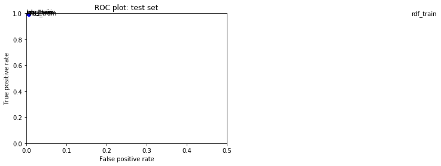
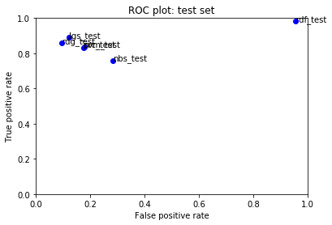

## IMDB Movie Review NLP Supervised Learning Log

### V2 ([Final Version](moviereviews_Inhye_RESUBMISSION_v1.ipynb). May 1 2020)

#### Sentiment Analysis: IMDB dataset
I chose the IMDB dataset for the Natural Language Processing Sentiment Analysis because I wanted to spend time with the contents within storytelling rather than real life-based toxic comments.  

####  Vectorizer: Hashing Vectorizer vs Count Vectorizer
According to sources including [this](https://kavita-ganesan.com/hashingvectorizer-vs-countvectorizer/#.XquCxhNKh26), there are a few differences between Hashing Vectorizer and Count Vectorizer.  The core strength of Hashing Vectorizer is that it excels in dealing with a large set of textual data, as it doesn't have to store individual vocabulary in memory (=>faster processing). This very nature also works as a weakness: you can not retrieve the actual token, for instance, for keyword extraction. 

The IMDB dataset had 25,000 entries. By an ML standard, it may not be a very large dataset. However, for my final submission, I continued working with Hashing Vectorizer. Mainly, I was curious to see how much performance improvement could be made with this vectorizer, without switching over to Count Vectorizer.

One aspect I worked on was trying to find the optimal number for “n-features”. In the previous submission, increasing  “n_features” of Hashing Vectorizer resulted in a meaningful boost so I went a little further with it this time. When n-features increased from 2 ** 21 to 2 ** 25, I saw another noticeable performance gain. I ended up increasing it up to  2 ** 27. The computer fan activated for a while (I think it ran much shorter than 1 minute to do the calculation) but it was manageable and did not kill my machine.

Two Things I noticed:
* The Ridge Regression took the longest to provide the model fit under this setting. 
* Random Forest didn't perform so well last time, but with this n-features, it really proved to be a wrong model. guessing most inputs as positive comments. 

#### Features
I added two new features. After hearing about the fellow coursetakers’ method of using exclamation and question marks, I came to think about the count of special characters myself. I included question marks (>=2) and interrobangs (?! or !?) count as part of the feature. I didn’t count multi exclamation (!!), thinking that it could be used for both positive and negative comments. 

In the same way as for the previous submission, after counting these, I did a little bit of text clean-up, by getting rid of punctuations, any html markups (text inside <>) and common english stop words and generic movie-specific words to reduce the size of the data. After this process, I counted the remaining words from each comment. I did not include word count or punctuation count in the features

Though they seemed to have small effects, I’m not entirely sure how significantly the performance improved due to these features. In my case, the size of n-features in the vectorizer proved to be the most important factor to benefit the performance. 

#### Alpha => Model Normalization
“Alpha” value made a bit of contribution to improve the quality of the prediction for individual models. In the case of the  Logistic Regression model (LGS), which I chose for my final submission, the True Positive prediction improved after I lowered the alpha to 0.5 (previously set to 10). For the Ridge Regression model (RDG), alpha was lowered to 1.5 (previously set to 3), and it made a minor improvement for the model. 

#### Final Choice
In the previous submission, the True Positive rate was almost indiscernible for both LGS and RDG so I went with RDG for its lower FP rate. This time, I chose LGS for its improved True Positive rate with the testing set (0.859 -> 0.89), though the False Positive rate increased a tad bit as well (0.117->0.12). RDG still showed the lowest False Positive rate among all models, on the other hand. I am curious to see the model performance with the new unseen data. 

#### Training Set Plot

#### Test Set Plot

### V1 ([Resubmission](moviereviews_inhye_submission_v1.ipynb). March 21 2020)
- fit_transform (training) vs transform (testing) added
- fitted_transformations array added
- Hashing Vectorizer (n_features increased to 2 ** 21)
- Text Cleaning : Movie specific words removed

### V1 (March 6 2020)
- Text Cleaning : Lowercasing, general stop words/some formatting/punctuation removal for reducing the data.
- Hashing Vectorizer (n_features increased to 2 ** 18 to cope with text classification)/ TFIDF transformer 
- OLS removed from the model testing list (Not performing so well)
- Experimented with the alpha value a bit for regularization 
- Ridge Regression selected for this iteration for the better accuracy in the test set, over other models 
