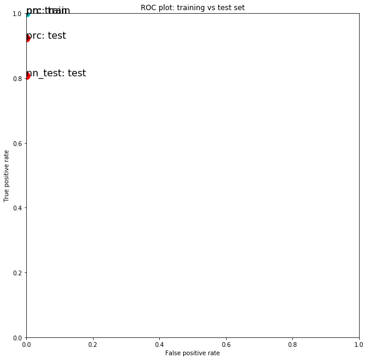

## Airplane Image Classification Supervised Learning Progress Log

### V2 ([Final Notebook](Inhye_planeimages_Final.ipynb), [csv](airplane_submission_Final.csv), May 2, 2020) 

#### Attempts to address issues which occurred in the previous model
In the previous submission, slightly different results were drawn upon running the same model with exact same settings. One suggestion from Aaron to tackle this issue (in order to get to a gradient descent, which my model may not have been doing ) was 
- Using a higher number for max_iter: Previously set to 1000 for both models.
- Trying a larger learning rate: (Reference: Learning rate is between 0 and 1, larger values make the weight changes more volatile. By default, it is set to 0.001 in both models). 
- Or, the combination of the two.

A few sets of different values were tried, but I still seem to have the same issue.
- PRC: Learning_rate seems to be set as constant, and you can’t change it. max_iter: 3000
- Neural Network: Previously, learning_rate was set to 0.001 and was constant throughout. I tried different values and changed it back to default. max_iter: 2000

Maybe the issue comes from the small number of airplane images, which creates the fluctuation of prediction? Still a mystery...

#### Random seed in train - test split
My_random_seed was switched from 99 to 30, to see if it makes any difference in the train - test split, as it is the place where the number of airplane images is decided for the dataset. Now the test set has 26 airplanes images out of 101 total and it seems to be a good factor for my model. 

#### Image Detection 
For the previous submission, I used a multi-stage edge detector, [Canny filter](https://scikit-image.org/docs/dev/auto_examples/edges/plot_canny.html). The previous model's performance improved upon changing a few attributes of this method but the results didn't seem very optimal. I decided to switch over to [Histogram of Oriented Gradients](https://scikit-image.org/docs/dev/auto_examples/features_detection/plot_hog.html), that a few coursetakers mentioned during the class.

With the default setting of HOG, the model performance was very poor.  A few parameters changed from default, and contributed to the improvement of the model. At one point, my multi-layer perceptron model was taking forever to process. I changed a few parameters of HOG and max_iter & learning_rate of the model, and I also changed the solver back to lbfgs, expecting a faster convergence. Then, the model seemed to start working better. 

I was not able to display the image using HOG at this time. I referred to the display method in scikit’s HOG description page, which is using data.astronaut(). In this [test](HOG%20Test.ipynb) notebook, it gives me an error when I’m trying to display the airplane image or any other random image file which I downloaded from the web), while the astronaut appears okay.

This is the error message -
“ValueError: Only images with 2 spatial dimensions are supported. If using with color/multichannel images, specify `multichannel=True`.

Multichannel was set to True so I’m a little unclear what causes this error.

#### Final Choice
Same as the last time, Perceptron performed better for me. 
Here is the comparison plot. 

### V1 ([Notebook](Inhye_planeimages_V1_Submission.ipynb), [csv](airplane_submission_V1_re.csv), Apr 2 2020)

Both models had a very low FP rate.
Perceptron (PRC) chosen over Multi layer Neural Network (NN) for this version for a Higher True Positive Rate.

1. Overall Image treatment:  
Canny edge detection was used this time. Played with sigma, low_threshold, high_threshold

2. For PRC - SGDClassifier:  
A combination of lower alpha and a different penalty was used

3. For NN - MLPClassifier:  
A combination of lower alpha, hidden_layer_sizes lowered from 100 to 75, solver changed to 'lbfgs'

Question 1: The prediction of each model seems to vary every time it runs even when features/parameters remain unchanged. Why?  
Question 2: Canny Edge Detection was used for this round. A plane's wings have diagonal lines with connecting curves and an aircraft body has long & straight-ish lines. Are they well recognized in the feature now? I am interested in trying out other image processing methods.  
Question 3: There are only 21 airplanes (Positives) in the testing set (1690 pictures). So, missing one picture of an airplane greatly affects the TPR which is TP / (TP + FN). Would including more pictures of airplanes in this set change the prediction? 

