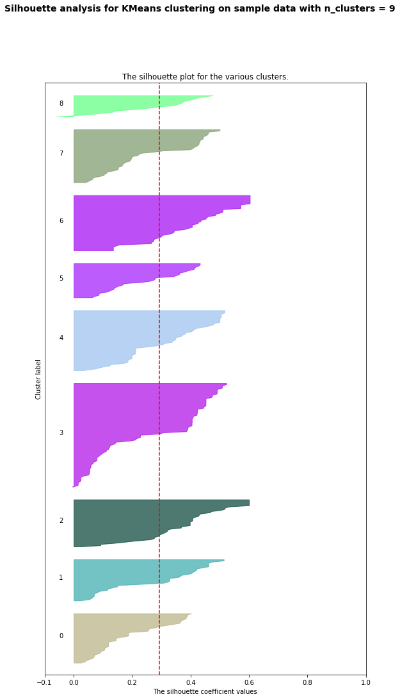
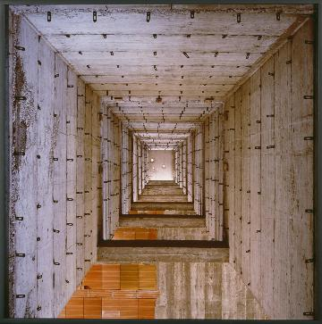
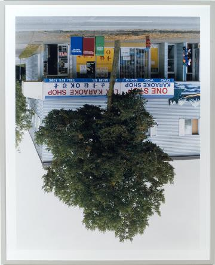

### Museum Image Curation via K-means Clustering: Progress Log 

#### V1 (April 19 2020)

1. I created clusters based on the following six metadata variables in the dataset. 
- has_text: image contains text?
- represenation - True if very realistic
- va: various degree bet. black & white
- te: texture 
- co: color (hue) 
- or: orientation, ranging from the vertical to the horizontal direction 

2. I chose 9 clusters, based on the elbow plot result and the silloutte analysis.  
 
 

3. Here are the curated "themes" I found in each of 9 clusters.  
- Cluster 0: Bold exploration of spatial dimension
- Cluster 1: Shades of the human mindset
- Cluster 2: Warm
- Cluster 3: Surreal caught between chaos and organization 
- Cluster 4: Exploration of dimensions, be it mental, imaginary or spatial
- Cluster 5: Abstract
- Cluster 6: Looking for the warmth 
- Cluster 7: Deconstructing squares
- Cluster 8: Segmentation

4. Among the 9 clusters, my personal favorite is the 8th cluster (Cluster 7), which I named "Deconstructing squares". Here, the collected artworks seem to explore what we can recognize as "squares". The collection exposes viewers visual elements that geometrically constitute a square or elements which can be seen as a deconstructed or deformed image of a square.  
Below are some images from the Cluster 7.  For other clusters, please take a look at the image display at the bottom of the notebook [page](Inhye_Cluster_Submission_v1.ipynb).  
 
 
 
 
 
 
 

