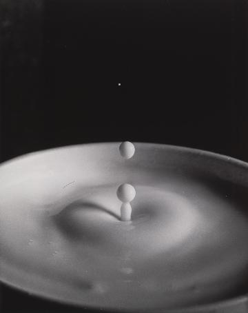
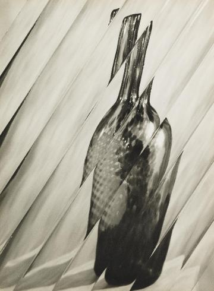
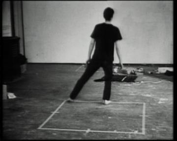

## Museum Image Curation via K-means Clustering: Progress Log 

### V2 ([Final Notebook](Cluster_Submission_Final.ipynb), May 4, 2020) 

#### Features selected from the metadata

For the final version of this K-means clustering, I decided to use features from the metadata which specifically address “spatial” characteristics (location, orientation or movement) of visual elements in each artwork.

My chosen variables are as follows.

- spatial_dimension - TRUE if the work is strongly spatial
- spatial_dimension2 - TRUE if the work is somewhat spatial
- kinetic - TRUE if the work is kinetic (****** My interpretation -  If a work itself is able to “move”, it can add to the interpretation of a given space)
- pl: given location on planar dim
- or: orientation 
- li: line  (****** My interpretation -  A line can easily divide a given space)
- ar: measurable area 

#### The Elbow Plot and the Silhouette graph
From the elbow plot, the elbow seemed to exist somewhere between 3 and 15. 

From the silhouette graph, I decided that the k = 6. Even though the average silhouette_score (: about 0.3426 ) was not the highest, the values were pretty coherent within each group, and no visible outliers were noticed. 

K=8 was a strong contender too (average silhouette_score: about 0.3644) except for some outliers of the cluster #4. 

However, I finally concluded K=6, after comparing the images under these two Ks.

#### Themes
Here are the curated "themes" I found in each of 6 clusters this time.
- Cluster 0: Fragmented
- Cluster 1: Lump, Lump, Lump
- Cluster 2: Lines  
- Cluster 3: Bold and Mixed
- Cluster 4: Movement (especially, with the diagonal lines) 
- Cluster 5: Division of a space

Below are some images from Cluster 1  and Cluster 4, which I found most interesting. For all the other clusters, please look at the bottom part of the [final notebook](Cluster_Submission_Final.ipynb).

#### Cluster 1 (Lump, Lump, Lump) 
 
 
 
 
 
 
 
 
 

#### Cluster 4 (Movement) 
 
 
 
 
 
 
 
 
 

#### Human Tendency
Analyzing each cluster, I noticed my human tendency to try to find a pattern. For example, once I saw a “lump” appearing in a series of artworks, I hoped that this trend continued throughout the cluster and might have disregarded what did not fit into the definition of “lump”. 

#### Final Words
For this project, I created two models ([V1](Inhye_Cluster_Submission_v1.ipynb) and [Final](Cluster_Submission_Final.ipynb)), and each model presented at least a couple of quite interesting clusters to me. I thought that by using multiple models, I could find different groups that could be meaningful as curated artworks. 

Clustering is a way to find a pattern amongst a group of things. However, humans are great pattern-recognizers and decision makers. In that sense, ML clustering can be an additional aid for us to discover tendencies within the artwork. The final “curatorial” decision will always have to be made by humans. (I hope)

-------

### V1 (April 19 2020)

1. For this round, I was interested in finding out whether a few of Bertin's retinal variables (values, texture, color and orientation) and two expressions (Use of text or not, Very realistic representation or not) could be used to find meaningful clusters in the given image-set. Initially, I included "kinetic" as part of the variables but realized that it was a boolean value and that only a handful of artworks were associated with this variable, so I ended up not using it. I also did not add any other features via image recognition. For the next round, if possible, I'd like to see if I could put more thoughts into choosing variables that can address the spatial "movement" of visual elements.  
For this version, following six metadata variables were included from the dataset. 
- has_text: image contains text?
- represenation - True if very realistic
- va: value. various degree bet. black & white
- te: texture 
- co: color (hue) 
- or: orientation, ranging from the vertical to the horizontal direction 

2. I chose 9 clusters, based on the elbow plot result and the sillhoutte analysis.  
From the elbow plot, it seemed evident the "K" could be found somewhere between 5 and 15.
 
The sillhoutte analysis was run for a few "K" values within this range and K = 9 was selected based on the average sillhoutte scores. Each cluster seemed reasonably coherent, though Cluster 3 & Cluster 8 showed a little bit of outliers. 
 

3. Here are the curated "themes" I found in each of 9 clusters.  
- Cluster 0: Bold exploration of spatial dimension
- Cluster 1: Shades of the human mindset
- Cluster 2: Warm
- Cluster 3: Surreal caught between chaos and organization 
- Cluster 4: Exploration of dimensions, be it mental, imaginary or spatial
- Cluster 5: Abstract
- Cluster 6: Looking for the warmth 
- Cluster 7: Deconstructing squares
- Cluster 8: Segmentation

4. Among the 9 clusters, my personal favorite is the 8th cluster (Cluster 7), which I named "Deconstructing squares". Here, the collected artworks seem to explore what we can recognize as "squares". The collection exposes viewers compositions that geometrically constitute a square as a whole or elements that can be seen as a deconstructed, deformed or repetitive image of a square.  

Below are some images from the Cluster 7.  For other clusters, please take a look at the image display at the bottom of the notebook [page](Inhye_Cluster_Submission_v1.ipynb).  
 
 
 
 
 
 
 

